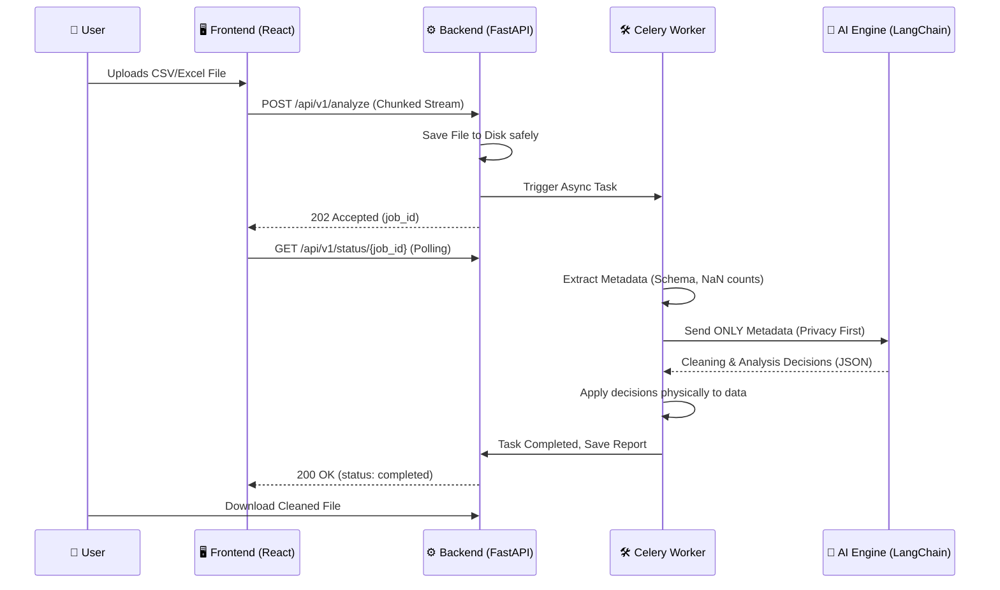

<div align="center">
  <h1>🧠 DataSense</h1>
  <p><b>An LLM-powered autonomous agent for intelligent data cleaning, EDA, and preprocessing.</b></p>
  
  [](https://opensource.org/licenses/MIT)
  [](https://fastapi.tiangolo.com/)
  [](https://reactjs.org/)
  [](https://www.docker.com/)
  [](https://www.terraform.io/)
</div>

---

DataSense automates the essential stages of the data science workflow. Upload raw data, and our AI agent will autonomously analyze, clean, and prepare your files for machine learning tasks while preventing Out-of-Memory (OOM) errors via chunk-based processing.

## 🚀 Key Features

- **AI-Powered Cleaning:** Intelligent handling of missing values and data inconsistencies.
- **Automated EDA:** Data profiling and dynamic visualization generation.
- **Privacy-Centric:** Only metadata is processed by the LLM (LangChain/Groq) to ensure data security.
- **OOM Protection:** Large gigabyte-scale datasets are processed safely using 10MB chunk-based streaming and `Polars` LazyFrames.
- **Production-Ready:** Includes a built-in Locust load testing suite and Terraform templates for 1-click cloud deployment.

## 🏗️ System Architecture & Data Flow



## 🛠 Tech Stack
- **Backend:** FastAPI, Python 3.11
- **AI Engine:** LangChain + Gemini / Groq API
- **Data Processing:** Pandas & Polars
- **Task Queue:** Celery + Redis
- **Load Testing:** Locust
- **Infrastructure:** Docker, Terraform (AWS)

## 💻 Getting Started

### Prerequisites
- Docker & Docker Compose
- API Keys (Groq / OpenAI / Gemini)

### 1. Local Development (Docker)
The easiest way to run DataSense is using Docker Compose.

```bash
git clone https://github.com/Diyarbakir-Yazilim/datasense.git
cd datasense

# Setup Environment Variables
cp .env.example .env

# Build and Start
docker-compose up --build -d
```
- **UI:** http://localhost:3000
- **API Docs:** http://localhost:8000/docs
- **Locust Load Tests:** http://localhost:8089

### 2. Production Deployment (Infrastructure as Code)
DataSense includes a complete "Production Deployment Kit" for AWS.

1. Configure your AWS CLI credentials.
2. Navigate to the terraform directory:
   ```bash
   cd terraform/aws
   terraform init
   terraform apply
   ```
3. Once the EC2 instance is up, SSH into the server and run the included `deploy.sh` script to automatically start the `docker-compose.prod.yml` optimized production stack.

---
*Maintained by the Open Source Community.*