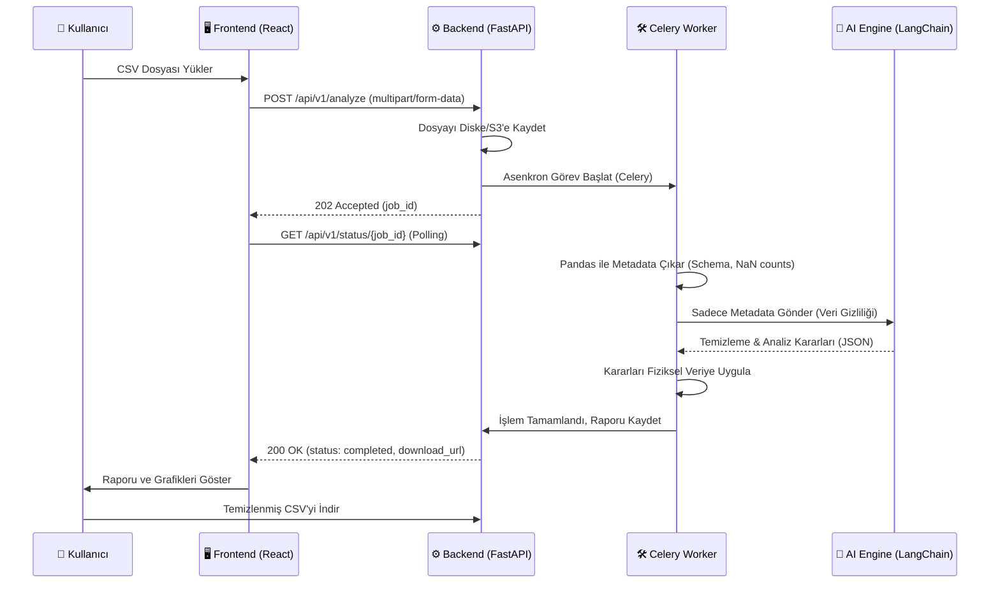

# DataSense 🧠


**An LLM-powered autonomous agent for intelligent data cleaning, EDA, and preprocessing.**

DataSense automates the essential stages of the data science workflow. Upload raw data, and our AI agent will autonomously analyze, clean, and prepare your files for machine learning tasks

## 🚀 Key Features
- **AI-Powered Cleaning:** Intelligent handling of missing values and data inconsistencies.
- **Task Identification:** Automatic detection of classification or regression problem types.
- **Automated EDA:** Data profiling and dynamic visualization generation.
- **Privacy-Centric:** Only metadata is processed by the LLM to ensure data security.

## 🏗️ System Architecture & Data Flow



## 🛠 Tech Stack
- **Backend:** FastAPI
- **AI Engine:** LangChain + Gemini API
- **Data Processing:** Pandas/Polars
- **Task Queue:** Celery + Redis

## 💻 Getting Started

### Prerequisites
- Docker & Docker Compose
- OpenAI / Gemini API Keys

### Installation & Running Locally (with Docker)

The easiest way to run the entire DataSense stack is using Docker Compose. This will automatically build and link the Frontend, Backend, AI Engine, Celery Worker, and Redis container.

1. **Clone the repository:**
   ```bash
   git clone https://github.com/Diyarbakir-Yazilim/datasense.git
   cd datasense
   ```

2. **Environment Variables:**
   Rename `.env.example` to `.env` and fill in your API keys (e.g., GROQ_API_KEY, OPENAI_API_KEY):
   ```bash
   cp .env.example .env
   ```

3. **Run the application (Docker):**
   Execute the following command in the root directory to build and start all services:
   ```bash
   docker-compose up --build
   ```
   *Note: If you want to run it in the background, add the `-d` flag: `docker-compose up --build -d`*

Once the containers are running:
- **Frontend (UI)** will be available at: http://localhost:3000
- **Backend (API)** will be available at: http://localhost:8000/docs

### 🛑 Stopping the Application
To stop all services and preserve data:
```bash
docker-compose stop
```
To shut down completely and remove containers:
```bash
docker-compose down
```

---
*Autonomous Data Analysis Pipeline.*