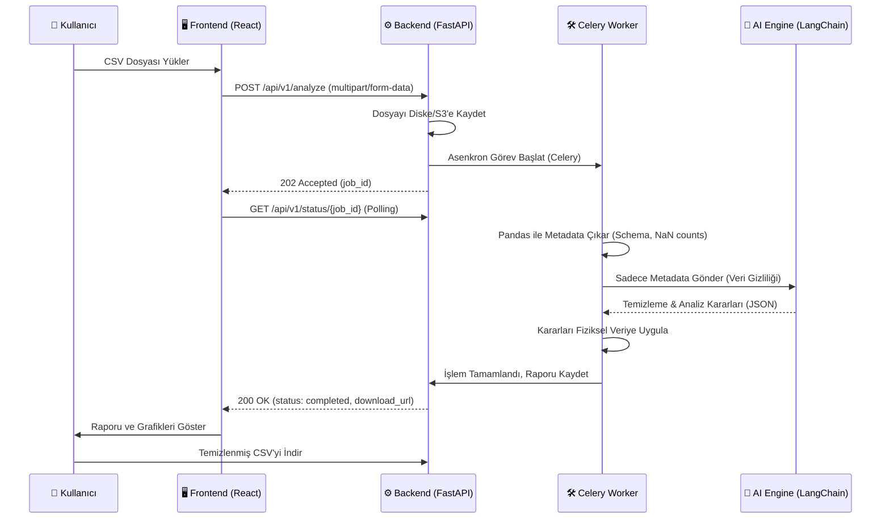

# DataSense 🧠


**An LLM-powered autonomous agent for intelligent data cleaning, EDA, and preprocessing.**

DataSense automates the essential stages of the data science workflow. Upload raw data, and our AI agent will autonomously analyze, clean, and prepare your files for machine learning tasks.

## 🚀 Key Features
- **AI-Powered Cleaning:** Intelligent handling of missing values and data inconsistencies.
- **Task Identification:** Automatic detection of classification or regression problem types.
- **Automated EDA:** Data profiling and dynamic visualization generation.
- **Privacy-Centric:** Only metadata is processed by the LLM to ensure data security.

## 🏗️ System Architecture & Data Flow



## 🛠 Tech Stack
- **Backend:** FastAPI
- **AI Engine:** LangChain + Gemini API
- **Data Processing:** Pandas/Polars
- **Task Queue:** Celery + Redis

## 💻 Getting Started

### Prerequisites
- Docker & Docker Compose
- OpenAI / Gemini API Keys

### Installation & Running Locally

We provide a `Makefile` to make running the project via Docker extremely simple.

1. **Clone the repository:**
   ```bash
   git clone https://github.com/Diyarbakir-Yazilim/datasense.git
   cd datasense
   ```

2. **Environment Variables:**
   Rename `.env.example` to `.env` and fill in your API keys:
   ```bash
   cp .env.example .env
   ```

3. **Run the application:**
   You can easily start the whole stack (Frontend, Backend, AI Engine, Redis, Worker) using the Makefile:
   ```bash
   make up
   ```

### 🔧 Useful Makefile Commands
- `make build` : Build all docker images
- `make up` : Start all services in the background
- `make logs` : View live logs of all services
- `make down` : Stop all services
- `make clean` : Stop services and delete volumes/data

---
*Autonomous Data Analysis Pipeline.*